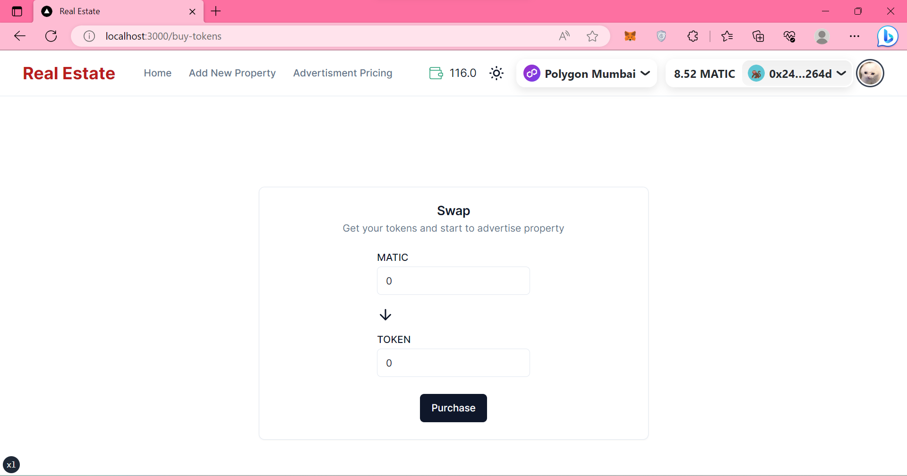

# Real Estate dApp

A tokenized real estate advertising app utilizing blockchain to store the data.

The frontend is built using Next.js, shadcn/ui component library, and Tailwind CSS. 

## Usage
In the project directory, you can run:
### `yarn`
Initialize the project (installing necessary packages/libraries)

### `yarn run dev`

Run the app in the development mode.\
Open [http://localhost:3000](http://localhost:3000) to view it in the browser.

## Features

- View real estate information
- Purchase tokens to be used for listing the advertisement 
- Add real estate advertisement.

## Screen Shots
Homepage

Property Details

Purchase tokens

Add Property

## License

Licensed under the [MIT license](https://github.com/shadcn/ui/blob/main/LICENSE.md).

